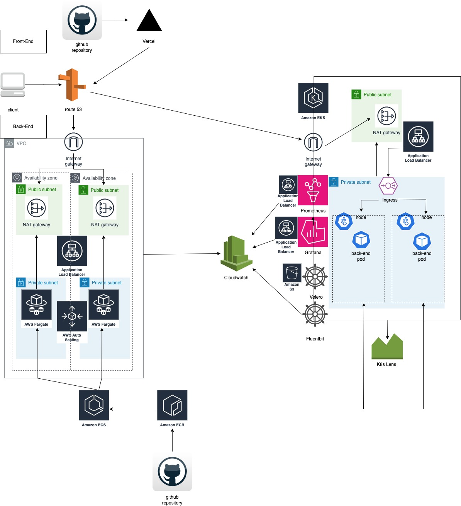

# OrderHere-frontend

## Overview
This document provides a high-level overview of the architecture for our system. The design is focused on ensuring scalability, reliability, and efficiency across all aspects of the application.

## Architecture

The following architecture diagram illustrates the high-level structure of our system:

### Frontend

- **Vercel**: Our frontend is deployed on Vercel for serverless hosting, providing seamless scaling and a robust deployment pipeline.
- **GitHub Repository**: The source code for the frontend is maintained in a GitHub repository with automated deployments to Vercel upon each push to the main branch.

### DNS Management

- **Route 53**: We use Amazon Route 53 for DNS management, which provides reliable and scalable routing to our frontend and backend services.